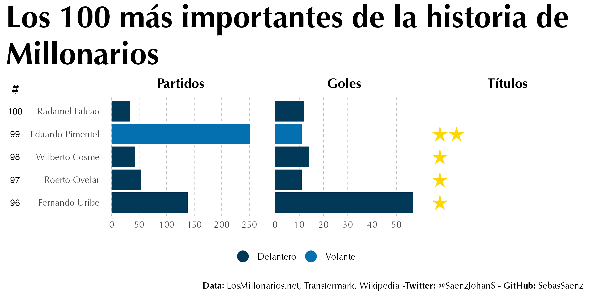
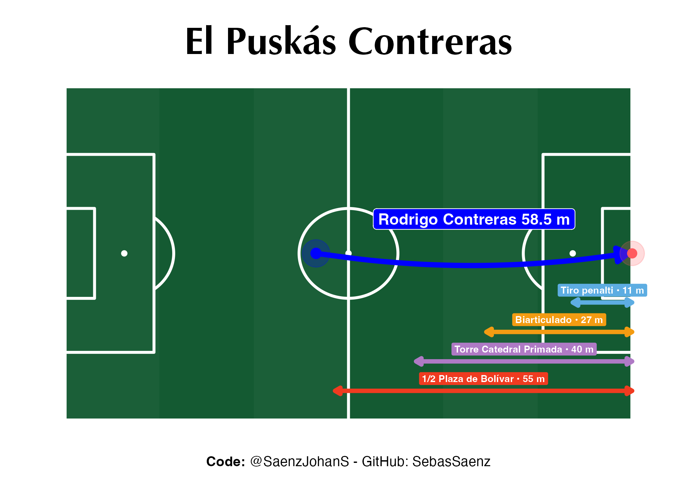
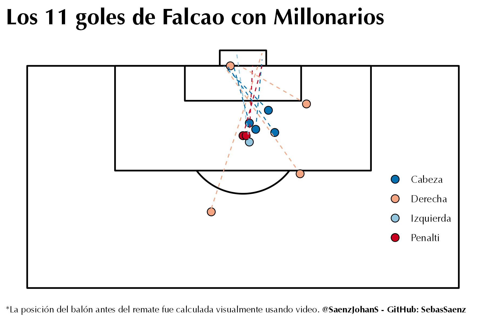
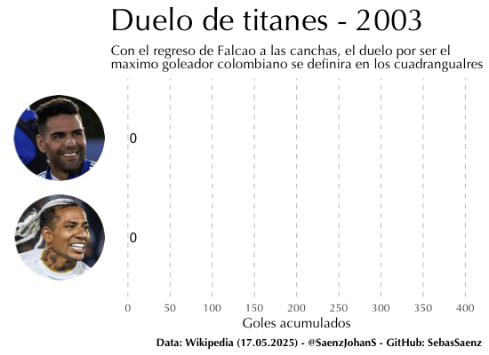
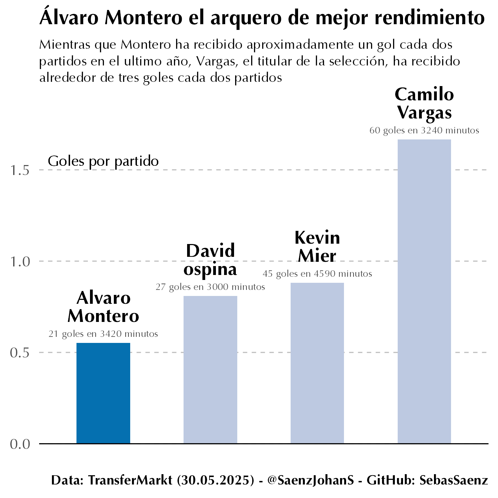
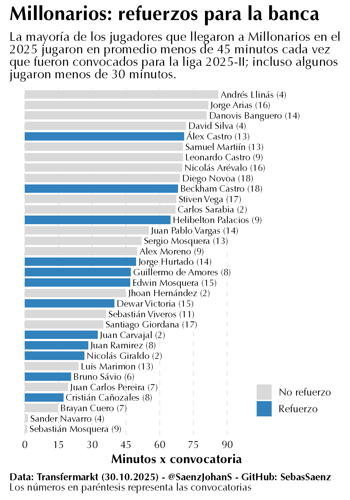
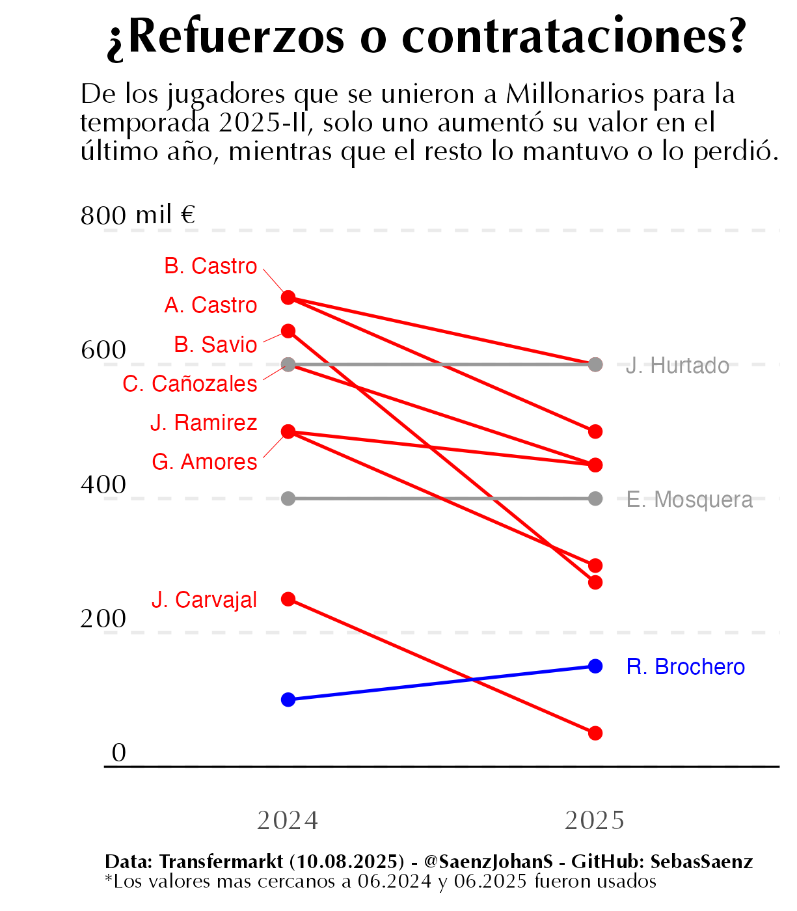

# Millonarios

Graficas y estadisticas del club de futbol mas grande de Colombia.

1.  [**Millonarios 2026**] (#millonarios-2026)

2.  [**Millonarios 2025**] (#millonarios-2025)

## Millonarios 2026

### **Los 100 mas importantes de Millonarios**

Millonarios tiene una larga lista de leyendas y orgnaizarlas es un gran tarea.

{width="50%"}

### **Gol de Antología**

Rodrigo Contreras marco un gol de casi 60 metros, tan largo que podria cruzar la plaza de Bolívar.

{width="350"}

### **Goleador vamos goleador**

Radamel Falcao ha marcado mas de 10 goles con Millonarios, incluidos de cabeza, izquierda y derecha.

{width="350"}

## Millonarios 2025

### **Duelo de titanes**

Radamel Falcao esta en la pelea por ser el goleador historico colombiano.

{width="400"}

### **Quíen merece ser el arquero de la seleción Colombia?**

Alvaro Montero es lejos el mejor arquero, pero suma pocos minutos en la selección Colombia.

{width="50%"}

### **Minutos jugados por convocatoria**

La mayoría de refuerzos de Millonarios sumaron mas minutos en la banca que en la cancha.

### **Contrataciones de papel**

Para el segundo semestre de 2025 Millonarios solo contrato refuerzos a la baja.

{width="50%"}
